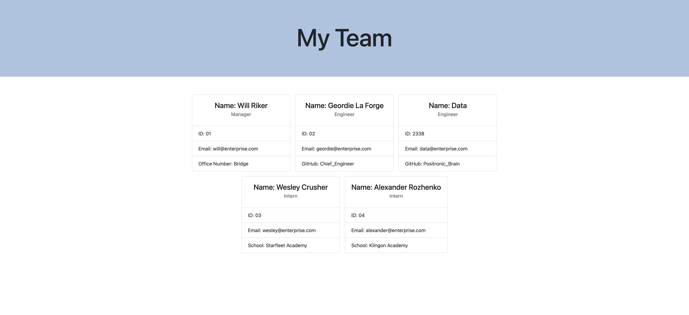

# TeamProfileGenerator

The objective of this assignment is to create an application where a manager is able to create a webpage that displays their teams basic information, such as their GitHub profile and email.

# Criteria 

```md
GIVEN a command-line application that accepts user input
WHEN I am prompted for my team members and their information
THEN an HTML file is generated that displays a nicely formatted team roster based on user input
WHEN I click on an email address in the HTML
THEN my default email program opens and populates the TO field of the email with the address
WHEN I click on the GitHub username
THEN that GitHub profile opens in a new tab
WHEN I start the application
THEN I am prompted to enter the team manager’s name, employee ID, email address, and office number
WHEN I enter the team manager’s name, employee ID, email address, and office number
THEN I am presented with a menu with the option to add an engineer or an intern or to finish building my team
WHEN I select the engineer option
THEN I am prompted to enter the engineer’s name, ID, email, and GitHub username, and I am taken back to the menu
WHEN I select the intern option
THEN I am prompted to enter the intern’s name, ID, email, and school, and I am taken back to the menu
WHEN I decide to finish building my team
THEN I exit the application, and the HTML is generated
```

# License 


# Screenshot | Video

[Link to Video](https://watch.screencastify.com/v/I7L3aQP4WYr7fkAJuLVL)



# Deployed Link

[GitHub Pages Link](https://mlh19.github.io/TeamProfileGenerator/)

# Other Details

- Worked on this assignment with help from my UT Tutor and Damien Luzzo.

- This application uses __Jest__ for running unit tests and __Inquirer__ for collecting input from the user.

- Resources : 
    
    https://www.computerhope.com/jargon/r/regex.htm

    https://getbootstrap.com/

# Let's Connect! 
    
GitHub: [mlh19](https://www.github.com/mlh19)


Email: [ml.hoover@yahoo.com](mailto:ml.hoover@yahoo.com)


